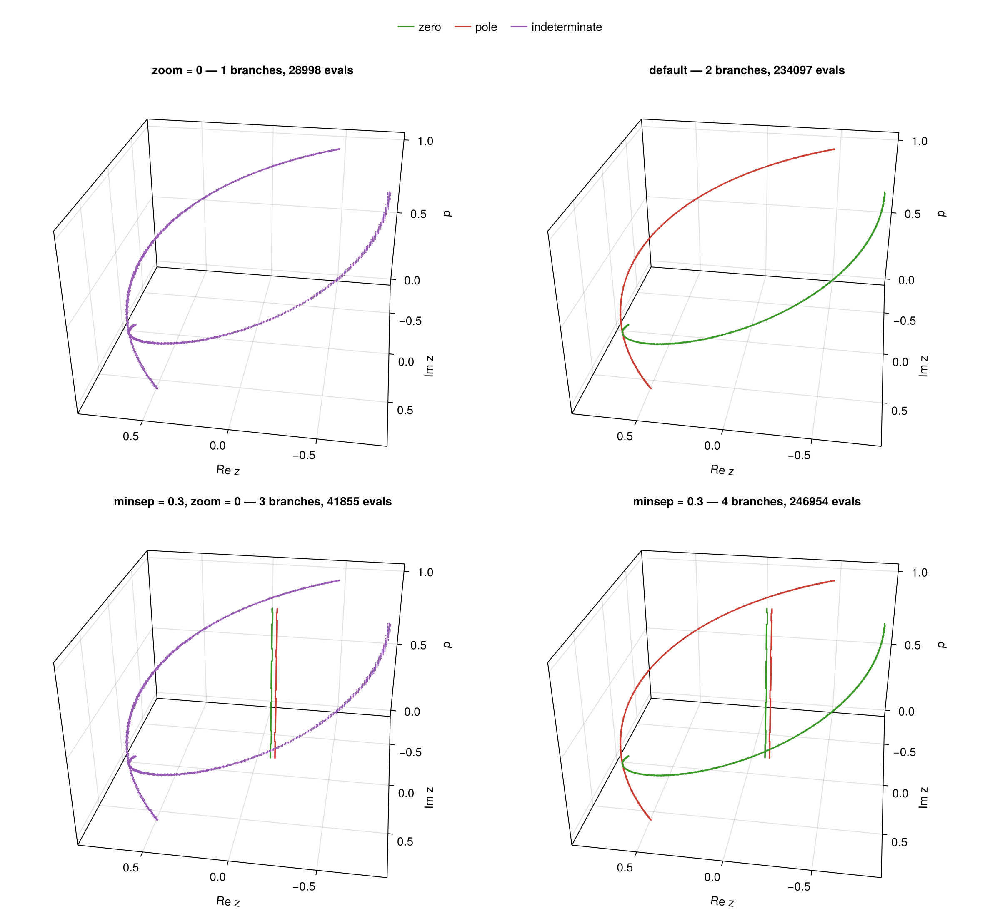

# MeromorphicLoci.jl

Find every zero and pole of a meromorphic `f(z, p...)` (complex `z`, `m ≥ 0`
parameters `p`) with one adaptive [region tree](https://github.com/rdeits/RegionTrees.jl),
refined only near the zero/pole **loci** `z*(p)` via Cauchy's argument principle —
not by solving `f(z; p)` independently at many parameter points.

`m = 0` → loci are points in `(Re z, Im z)`. `m = 1` → curves `z*(p)`. `m = 2` → surfaces `z*(p₁,p₂)`.

## Use

```julia
using MeromorphicLoci

# a zero and a pole winding around helices that graze at p ≈ 0.15 (0.004 apart),
# plus a fixed zero–pole pair 0.03 apart
f(z, p) = (z - 0.80 * cispi(p)) * (z + 0.10 + 0.12im) /
          ((z - 0.804 * cispi(-p + 0.3)) * (z + 0.13 + 0.12im))
box = ((-0.98 - 0.98im, 0.98 + 0.98im), (0.0, 1.0))  # one (lo, hi) per f arg; z complex
s = survey(f, box; zres = 0.02)                      # zres: z-plane resolution
@assert length(s) == 2
zero_branch = only(b for b in s if winding(b) > 0)
pole_branch = only(b for b in s if winding(b) < 0)
```

A `Branch` is one locus `z*(p)`: a vector of `Sample`s (cell centers sorted by
parameter). `winding(b)` classifies it — `> 0` zero, `< 0` pole, `0`
indeterminate — with magnitude the multiplicity.

Two clean branches here is **escalation** at work. At the graze the helices pass
closer than `zres`, their cells touch, and adjacency fuses them into one branch
whose winding cancels to 0. `link` refines such an ambiguous branch below
`zres`, up to `zoom` halvings, until it falls apart into cleanly labeled
sub-branches (with correspondingly finer samples). `zoom = 0` disables this:

```julia
@assert length(survey(f, box; zres = 0.02, zoom = 0)) == 1  # helices fused, winding 0
```

The fixed pair is invisible in both surveys — **base-cell aliasing**: a whole
base cell winds to 0 around it, and its phase footprint fades within a few
pair-widths (`f ≈ 1` outside), so nothing marks the cell for refinement.
Escalation cannot rescue what was never discovered; only a smaller `minsep` can:

```julia
@assert length(survey(f, box; zres = 0.02, minsep = 0.3, zoom = 0)) == 3
@assert length(survey(f, box; zres = 0.02, minsep = 0.3)) == 4  # default zoom = 4
```

`survey` = `scan` (adaptive refinement — the expensive phase) + `link`
(connectivity + classification):

```julia
sc = scan(f, box; zres = 0.02)
s  = link(sc)
```



## Knobs

**`zres`** — z-plane resolution of the reported samples; pure output spacing.

**`minsep`** (`scan`, default z-diagonal/8) — cell size the tree refines to
*before* the winding criterion may reject a cell. Keep it below the closest
spacing between distinct loci, or a coarser cell holding two of them aliases
their winding to 0 and drops them silently. Also the cost floor:
`(zdiag/minsep)^(2+m)` evaluations. (The example's `minsep = 0.3 ≫ 0.03` catches 
the pair only because a cell boundary happens to fall between its members; the
guarantee needs `minsep < 0.03`.)

**`zoom`** (`link`, default 4) — halvings below `zres` an ambiguous branch may
escalate before its winding is reported as 0. Winding 0 past the floor means a
pair fused tighter than `zres/2^zoom`, or loci genuinely crossing at some `p`.

**`keep(z, p...)`** (`nothing` ⇒ off) — domain mask. Cells with no kept corner
are never evaluated, refined, or reported — the escape hatch for an approximate
`f` whose spurious out-of-domain zeros would soak up the refinement budget.

```julia
survey(f, box; zres = 0.02, keep = (z, p) -> imag(z) > -0.1)
```

`f` and `keep` are batch-evaluated across all Julia threads; both must be
thread-safe (pure functions are).

## Notes

- **Touching loci merge** — connectivity is geometric. A zero `f` (built to
  have, say, a symmetry-forced factor `z^k`) spans all of `p` and fuses with any
  locus crossing it; divide such factors out of `f` first, or stop at `scan`
  and cluster the candidate cells yourself.
- **Lone loci rarely alias, pairs do** — a lone locus normally trips a face
  winding or the ≥3-quadrant corner guard at any `minsep`, so the `minsep`
  guarantee mostly matters for zero–pole pairs. Not absolute: winding samples
  only the box-induced corner lattice, and a steep-`|dz/dp|` branch crossing a
  base cell strictly between its two p-corner slices can go dark there — the
  branch then reports as two cleanly labeled arcs with a small sample gap.
  Benign but alignment-sensitive: nudging the box corners or `minsep` re-rolls it.
- [RootsAndPoles.jl](https://github.com/fgasdia/RootsAndPoles.jl) implements SA-GRPF through Delaunay triangulation for m=0 problem. 
  [Comparison benchmark](./benchmark/compare.jl) surveys the same 3-D box with both methods; our 3-D region-tree survey used 25× fewer evaluations and ran ~60× faster than 128 independent 2-D RootsAndPoles slices.